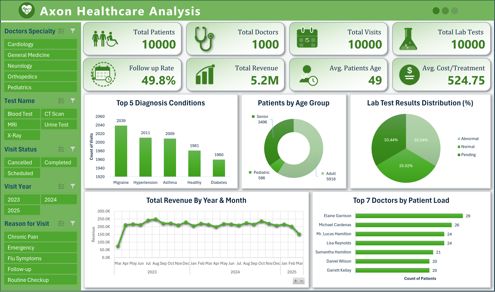
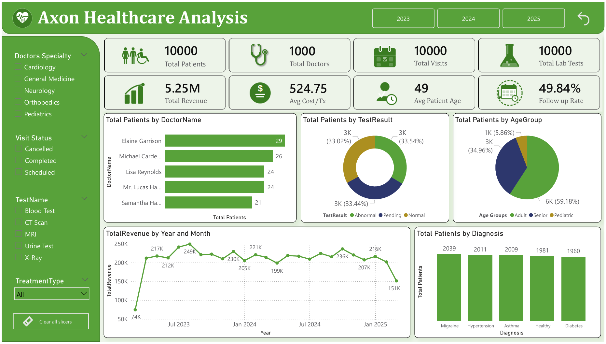
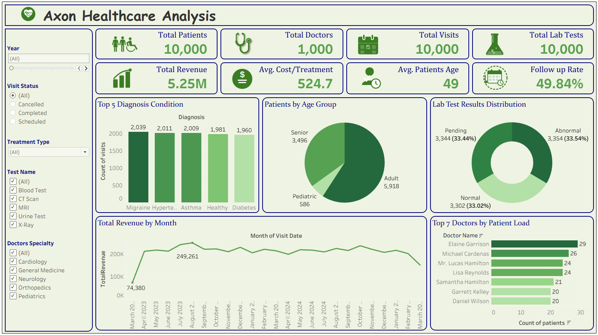

# 🏥 Axon Healthcare Analysis


> An end-to-end healthcare analytics project — from raw EMR data to interactive dashboards — built using **Excel**, **Power BI**, and **Tableau**.

---

## 📌 Project Overview

**Axon Healthcare** is a health technology company dedicated to transforming how clinics, hospitals, and healthcare providers manage patient data. By offering secure, scalable, and user-friendly Electronic Medical Records (EMR) software, Axon Healthcare helps healthcare organizations streamline operations, enhance patient care, and ensure compliance with medical data regulations.

### The Problem

Axon Healthcare was struggling to convert EMR data into meaningful insights due to **siloed systems**, **manual reporting**, and **lack of real-time visibility** into clinical and operational KPIs. Stakeholders relied on outdated Excel reports, making decision-making slow and reactive.

### The Solution

To address this, a full analytics pipeline was built to:

- Integrate EMR, billing, and operational data into a unified database
- Automate reporting processes using SQL and Python
- Build **interactive dashboards** for real-time insights in Excel, Power BI, and Tableau
- Improve performance tracking across clinics and departments

---

## 📁 Project Structure

```
healthcare-patient-analytics/

  01_Raw_Data/
    ├── patients_raw.xlsx
    ├── doctors_raw.xlsx
    ├── visits_raw.xlsx
    ├── treatments_raw.xlsx
    └── lab_tests_raw.xlsx

  02_Clean_Data/
    ├── patients_clean.xlsx
    ├── doctors_clean.xlsx
    ├── visits_clean.xlsx
    ├── treatments_clean.xlsx
    └── lab_tests_clean.xlsx

  03_Master_File/
    └── healthcare_master_clean.xlsx   ← ALL TOOLS connect to this file

  04_Dashboards/
    ├── healthcare_dashboard_excel.xlsx
    ├── healthcare_dashboard_tableau.twbx
    ├── healthcare_dashboard_powerbi.pbix
    ├── healthcare_dashboard_excel.png
    ├── healthcare_dashboard_tableau.png
    └── healthcare_dashboard_powerbi.png

  05_SQL/
    ├── 01_healthcare_db_schema.sql
    ├── 02_load_healthcare_data.txt
    ├── 03_healthcare_db_validation.sql
    └── 04_healthcare_dashboard_KPIs.sql

  05_Documentation/
    ├── Healthcare Project_Problem Statement.ppt
    ├── Healthcare KPI.docx
    └── QA Queries.docx
```

---

## 🗃️ Dataset Overview

The dataset simulates a real-world EMR system with **5 relational tables** with **10,000 total patients records**.

| Table | Records | Columns |
|---|---|---|
| `patients` | 10,000 | Patient ID, First Name, Last Name, Gender, Date Of Birth, Age, Blood Type, Address, City, State, Country, Phone Number, Contact Number, Emergency Contact, Insurance Provider, Policy Number, Medical History, Chronic Conditions, Allergies, Race, Ethnicity, Marital Status |
| `doctors` | 1,000 | Doctor ID, Doctor Name, Specialty, Phone Number, Email, Hospital Affiliation, Hospital/Clinic, Years Of Experience |
| `visits` | 10,000 | Visit ID, Patient ID, Doctor ID, Visit Date, Visit Type, Visit Status, Diagnosis, Diagnosis Code, Reason For Visit, Prescribed Medications, Follow Up Required |
| `treatments` | 10,000 | Treatment ID, Visit ID, Treatment Name, Treatment Type, Treatment Description, Medication Prescribed, Dosage, Instructions, Treatment Cost, Cost, Status, Outcome |
| `lab_tests` | 10,000 | Lab Result ID, Visit ID, Test Name, Test Date, Test Result, Reference Range, Units, Comments |

### Entity Relationship

```
patients ──< visits >── doctors
               │
       ┌───────┴────────┐
   treatments       lab_tests
```

---

## 🎯 Objectives

- Design a **relational database schema** to store and manage EMR data
- Write **SQL queries** to compute KPIs and validate data integrity
- Build **3 fully interactive dashboards** (Excel, Power BI, Tableau) from a single master data source
- Enable filtering by year, doctor specialty, visit status, test name, and reason for visit
- Track clinical and operational performance across departments

---

## 📊 Problem Statement & KPIs

Axon Healthcare needed a standardized way to monitor clinical and operational performance. The following **11 KPIs** were identified and implemented:

| # | KPI | Description |
|---|---|---|
| 1 | **Total Patients** | Count of unique patients in the system |
| 2 | **Total Doctors** | Count of active doctors on the platform |
| 3 | **Total Visits** | Total number of patient visits recorded |
| 4 | **Average Age of Patients** | Mean age across all registered patients |
| 5 | **Top 5 Diagnosed Conditions** | Most frequent diagnoses by visit count |
| 6 | **Follow-Up Rate (%)** | Percentage of visits requiring a follow-up |
| 7 | **Avg. Treatment Cost Per Visit** | Average cost of treatment across all visits |
| 8 | **Total Lab Tests Conducted** | Total number of lab tests ordered |
| 9 | **% Abnormal Lab Results** | Share of lab results flagged as abnormal |
| 10 | **Doctor Workload** | Average number of patients seen per doctor |
| 11 | **Total Revenue** | Sum of all treatment costs across the platform |

---

## 🛠️ Tech Stack

| Layer | Tools Used |
|---|---|
| **Data Cleaning** | Microsoft Excel ·  Power Query Editor|
| **Database** | MySQL |
| **Data Loading in MySQL Workbench** | Python · pandas · SQLAlchemy |
| **Querying & KPIs** | SQL |
| **Dashboarding** | Microsoft Excel · Power BI · Tableau |
| **Version Control** | Git & GitHub |

---

## 💡 Sample Insights

Based on the dashboard analysis:

- 🧑‍⚕️ **10,000 patients** are actively managed, with an **average age of 49**
- 💊 **Migraine** is the most diagnosed condition with **2,039 visits**, followed by Hypertension (2,011) and Asthma (2,009)
- 📅 **Follow-up rate stands at ~49.8%**, indicating nearly half of all visits require continued care
- 💰 **Total revenue reached $5.25M**, with an average treatment cost of **$524.75 per visit**
- 🔬 Lab test results are almost **evenly split** — Abnormal (33.54%), Normal (33.02%), Pending (33.44%)
- 👶 **Adults (59.18%)** represent the largest patient age group, followed by Seniors (34.96%) and Pediatrics (5.86%)
- 🏆 **Dr. Elaine Garrison** leads doctor workload with **29 patients**, followed by Michael Cardenas (26)
- 📈 Monthly revenue peaked at **$249K** mid-2023 and maintained stability through 2024

---

## 📸 Dashboard Screenshots

### 📊 Excel Dashboard


---

### 📊 Power BI Dashboard


---

### 📊 Tableau Dashboard


##### 🌐 Tableau Public Link

🔗 **[View Live Tableau Dashboard →](https://public.tableau.com/views/healthcare_dashboard_tableau/Dashboard?:language=en-GB&:sid=&:redirect=auth&:display_count=n&:origin=viz_share_link)**

---

## 📄 License

This project was completed as part of an internship at **AI Varient**.
The dataset was provided by the **AI Varient project mentor** for internship and training purposes.
This project is intended to demonstrate data analytics, dashboard design, and database management skills.
It is not intended for commercial use.
Feel free to use this project as a learning reference.

---

## 👤 Author

**Yash Patil**
- 💼 [LinkedIn](https://www.linkedin.com/in/yashpatil03/)
